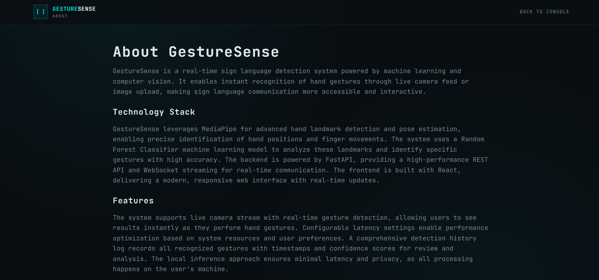

#  GestureSense - Sign Language Detection Console

GestureSense is a modern sign-language detection app with a sleek TanStack Start frontend and a FastAPI backend powered by a configurable vision model. It supports live webcam detection, single-image uploads, and a real-time detection log for quick feedback.

##  Screenshots





##  Features

- 🎨 **Modern Console UI** - Clean, futuristic interface with real-time status indicators
- 🤖 **AI Gesture Detection** - Gemini Vision or Groq Llama vision inference for uploaded images and webcam frames
- 📹 **Live Camera Stream** - Real-time detection through a websocket-driven webcam feed
- 🖼️ **Image Upload** - Single-frame gesture detection from image files
- 📊 **Detection Log** - Track recognized signs with timestamps and confidence scores
- ⚡ **Fast Status Checks** - Health endpoint keeps the frontend aware of backend/model readiness
- 📱 **Responsive Layout** - Works across desktop and mobile screen sizes

##  Tech Stack

### Frontend
- **Framework:** TanStack Start + React
- **Language:** TypeScript
- **Build Tool:** Vite
- **Styling:** Tailwind CSS
- **UI Components:** Radix UI + custom components
- **Routing:** TanStack Router
- **State/Data:** React state hooks + TanStack Query

### Backend
- **Framework:** FastAPI (Python)
- **AI Integration:** Google Generative AI / Gemini Vision or Groq Llama vision
- **Realtime:** WebSocket streaming for live camera frames
- **CORS:** Enabled for local frontend development
- **Environment Loading:** python-dotenv

### Deployment
- **Frontend:** Vite/TanStack build output
- **Backend:** Python FastAPI server
- **Version Control:** Git & GitHub

## 📂 Project Structure

```text
GestureSense/
├── src/
│   ├── components/
│   │   └── ui/
│   ├── hooks/
│   ├── lib/
│   ├── routes/
│   │   ├── __root.tsx
│   │   ├── index.tsx
│   │   ├── about.tsx
│   │   ├── faq.tsx
│   │   ├── privacy.tsx
│   │   ├── terms.tsx
│   │   ├── cookie.tsx
│   │   └── license.tsx
│   ├── router.tsx
│   ├── server.ts
│   └── styles.css
├── public/
├── gesturesense.py
├── requirements.txt
├── package.json
├── tsconfig.json
├── vite.config.ts
└── README.md
```


Made with ❤️ by Manas Rohilla
